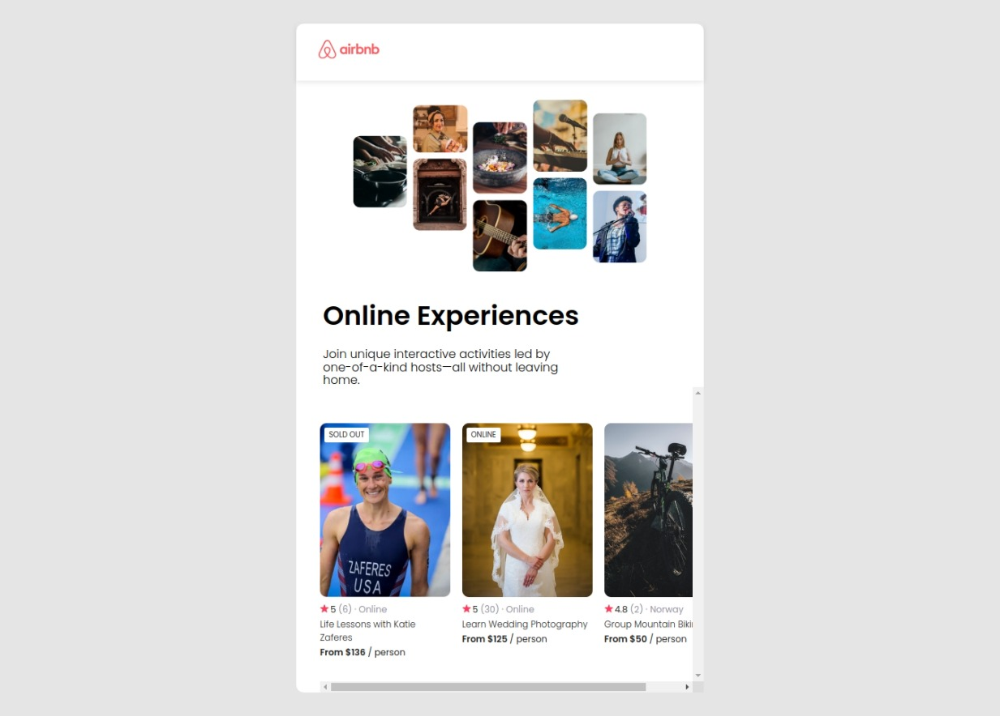

# React Airbnb Experiences

Este foi o terceiro projeto desenvolvido através do curso **React Course - Beginner's Tutorial for React JavaScript Library [2022]**

A idéia foi desenvolver um clone da página "Airbnb Experiences".

Link do curso:
https://youtu.be/bMknfKXIFA8

Link do design no Figma:
https://www.figma.com/file/4YjrygFEXOcDp9AAnVFv7o/Airbnb-Experiences?node-id=0%3A1&t=RtUtJCPB50cxuFs6-0

## Resultado:

